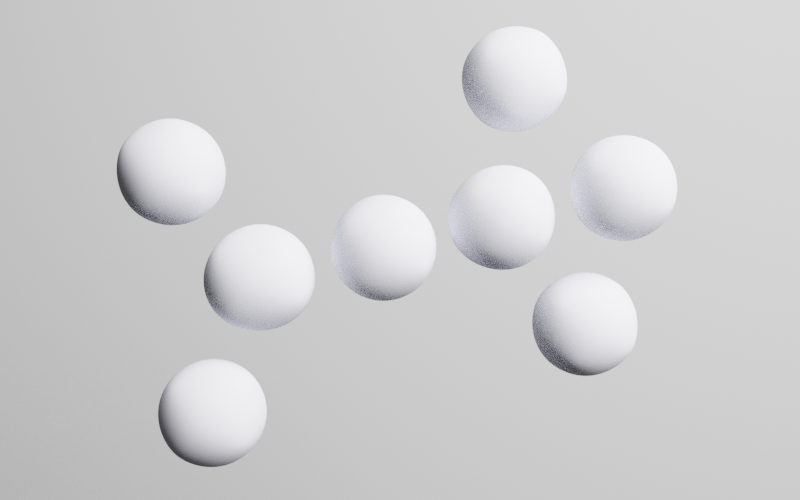

# two4two Image Dataset Generator

## Introduction
This program utilizes [blender](https://www.blender.org/) to generate image datasets.
Currently there are two classes.
They are smilar looking, abstract animals, made of eight blocks.
See [Section Classes](#classes) for details.
You can either install the module and create your own datasets or download an [example dataset](#example-dataset) with 300,000 images.

## Installation
Currently this project is not available through pip but has to installed manually.

Download this repository.

```
git clone https://github.com/mschuessler/242.git
cd 242
´´´

*On Mac Os*
```
`sed -i '' 's?REPLACE-WITH-PWD?'`pwd`'?' two4two/blender.py`
´´´
On all other *UNIX systems*:
```
`sed -i 's?REPLACE-WITH-PWD?'`pwd`'?' two4two/blender.py`
´´´
We suggest to create a python3 or conda environment instead of using your system python and install the requirements.
```
python3 -m venv ~/242_enviroment
source ~/242_enviroment/bin/activate
´´´

```
pip install --upgrade pip
pip install -r requirements.txt
```

Since we are using Blender to generate the images, it needs to know its absolute path we it will be run from. Unfortunately we have not implemented a more elegant way to address this. For now  

`make`

If this worked, you should be good.
If not, here are some more details for the installation.

The programm can only run, if Blender 2.83 is installed in `two4two/blender`.
The programm was tested with version 2.83.9.
The Makefile should download blender, install pip for its bundled python and install the two4two module.
The download link within the Makefile is a mirror for Germany.
If any problems occur please see the script and reproduce the steps.
You need to put blender in the module folder and install pip for blender.
Then use pip to install numpy, scipy, matplotlib and a ipykernel.
After installing blender, use `setuptools` to install the `two4two` module for both the systems python as well as blender's python.
`python setup.py install && ./blender/2.83/python/bin/python3.7m setup.py install`

## Classes
The two classes for classifcation are *sticky* and *stretchy*.
Both objects are build from 8 blocks that can have different shapes.
Either cubes, spheres or something in between.
A sticky object made from cubes looks like this:


A stretchy object made from spheres looks like this:


The shapes can also morph from spherical to cube like.
Here is an example for something in between:


These objects can be put into a random pose.



You can change color of both object and background.


To blur the difference between the two classes the position of the class-defining set of arms can be randomly shifted.
By choosing a distribution for this the separation between the classes can be adjusted.
The following three pictures are a sticky object with arm shift 0.


Arm shift 0.5.
This is equal to a stretchy object with shift 0.5.


And finally shift 1.
This is equal to a stretchy object with shift 0.


Further parameters that can be adjusted: Object rotation (2 axis), a random flip and the position within the frame.
Documentation obviously needs to be improved further.

## Example Dataset
You can download an example dataset if you just want to assemble a dataset.
There are six different sets with 50,000 images each.
For the two classes there is a set with cubes, spheres and random shapes respectively.
Within each folder there is a `parameters.json`.
Each line of the file contains a json with metadata of the sample.
You can use this to filter for background or object color for example.

## Generate your own dataset
See the jupyter-notebooks for inspiration.
You'll need to generate a parameter file and use that to generate the dataset.
When you generate a dataset there will be a new parameter file that includes all the filenames.
If you'll save the parameter file in the sample folder, you can also reproduce the file names.
Otherwise they will change if you reproduce the dataset from the parameter file.

In the `two4two.parameters.Parameters` class you can modify the `generate_parameters()` method to your needs or add a new one.
Just make sure you adjust all the parameters listed in the `__init__` method.
For creating specific examples you might also edit the class variables by hand.
See `examples/SampleExamples.ipynb` for explanations of the parameters and use it to play with them.

For rendering the samples you can choose a maximum number of parallel processes and the size of each processing chunk.
The number of processes will depend on your computer/CPU.
A chunk size of 50 appears to be a good value.
If you increase it to much, blender will start to get slow.
If you make it to small blender's startup time will be noticable.

See `examples/GenerateData.ipynb` for an example of generating parameters with `generate_parameters()` and then rendering them.


## Acknoledgement
Thanks to [Martin Schuessler](http://mschuessler.de/) for guidance and support.
I was working as a student assistent with him and developed this tool for his research.
Also thanks to [Leon Sixt](https://userpage.fu-berlin.de/leonsixt/) for help with some parts of the code and especially for the arm-shift idea.
And finally thanks to the rest of [Research Group 20](https://www.weizenbaum-institut.de/index.php?id=95&L=5) of the Weizenbaum Insitute for giving me the opportunity use my time to develop this and make it public.
### Funding
Funded by the GermanFederal Ministry of Education and Research(BMBF) - NR 16DII113.
